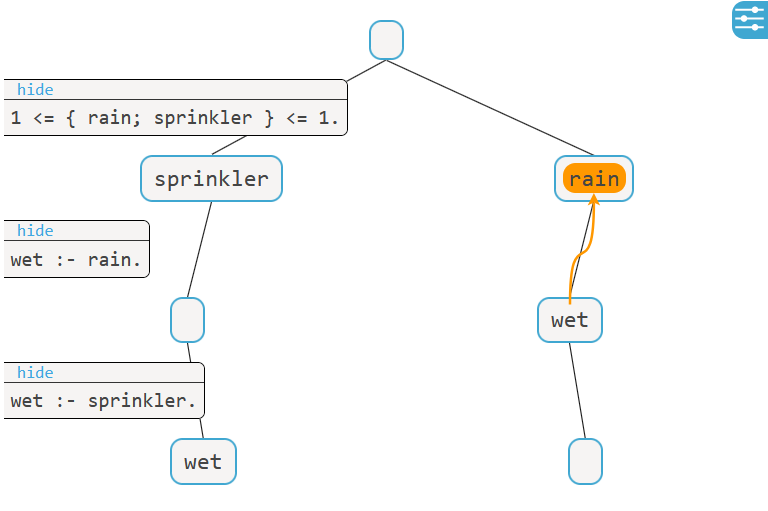

# viASP

[](https://github.com/potassco/viasp/actions/workflows/build_and_test.yml) [](https://viasp.readthedocs.io/en/latest/?badge=latest)

## viASP generates interactive visualizations of ASP encodings and stable models



viASP allows you to explore the visualization in a variety of ways:

* Follow the derivation of answer sets step-by-step
* Explain the derivation of individual symbols with arrows
* Inspect iterations of recursive rules
* Visualize unsatisfiable programs
* Move rules to follow a preferred order
* Zoom in and out of parts of the graph

## Installation

viASP is available as a [conda package](https://anaconda.org/stephanzwicknagl/viasp). You can install it with:

```bash
conda install viasp -c potassco -c conda-forge -c stephanzwicknagl
```

Alternatively, viASP is also available on [PyPI](https://pypi.org/project/viasp/). You can install it with pip:

```bash
pip install viasp
```

| :memo:        | To support the use of clingraph in viASP, install [graphviz](<https://www.graphviz.org/download/>)  (version 2.50 or greater) manually.       |
|---------------|:------------------------|

## Usage

Consider the file [`hamiltonian.lp`](https://github.com/potassco/viasp/blob/main/examples/hamiltonian.lp):

```prolog
node(1..4). start(1).
edge(1,2). edge(2,3). edge(2,4). edge(3,1).
edge(3,4). edge(4,1). edge(4,3). 

{ hc(V,U) } :- edge(V,U).
reached(V)  :- hc(S,V), start(S).
reached(V)  :- reached(U), hc(U,V).
:- node(V), not reached(V).
:- hc(V,U), hc(V,W), U!=W.
:- hc(U,V), hc(W,V), U!=W.
```

To start a visualization from the command line, run:

```bash
viasp hamiltonian.lp
```

Check out the [documentation](https://viasp.readthedocs.io/en/latest/) to see a full description on how to use viASP.

## Examples

An introduction to viASP's features is given in the [notebook](https://mybinder.org/v2/gh/stephanzwicknagl/viasp/main?filepath=examples%2FIntroduction%20to%20viASP.ipynb). The [examples folder](https://github.com/stephanzwicknagl/viasp/tree/main/examples) shows a variety of scripts that run viASP.

## Contributing

See the [documentation page](https://viasp.readthedocs.io/en/latest/viasp/contributing.html#contributing) to see how to contribute.
