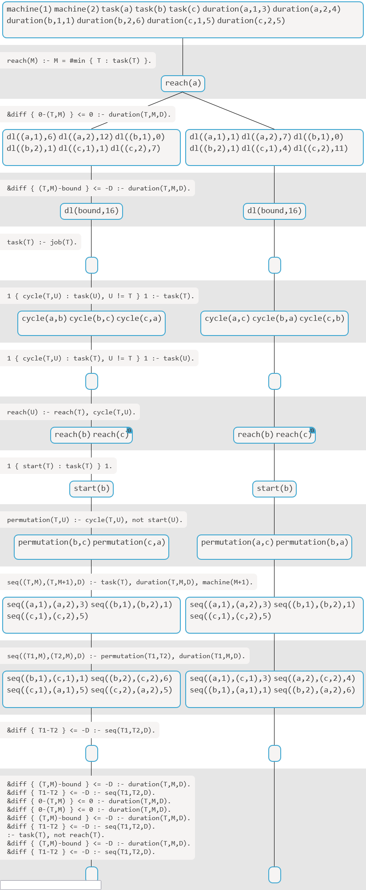

This example implements a way for viASP to support non-standard language extensions to clingo.

Using a [scaled down version of clingo-dl](https://github.com/potassco/clingo/tree/master/examples/clingo/dl), constraints of the following form are supported:

    &diff{u-v} <= d :- [rule body].

The difference constraints are used by the porpagator to find the optimal solution by assigning number values to the `u` and `v` using the `dl` atoms. 

A visualization is obstructed, as viASP does not support the Theory Atoms. viASP is oblivious to the connection between the atoms `&diff` in the program and `dl` in the stable model.

To help this, a Transformer is registered to help translate differnce constraints into rules on the `dl` predicate. The translation preserves the meaning of the constraint, but drops the ability to solve the problem. This is dispensable for viASP, as it is provided with the stable models.

    % input rule
    &diff(head) { (T,M)-(T,M+1) } <= -D :- duration(T,M,D).

    % transformed rules
    { dl((T,M),X) : X=0..max ; dl((T,M+1),X):X=0..max} :- duration(T,M,D).
    :- not { dl((T,M),X) : X=0..max }  = 1, duration(T,M,D).
    :- not {dl((T,M+1),X) : X=0..max } = 1, duration(T,M,D).
    :- dl((T,M),X), dl((T,M+1),Y), not X-Y<=-D, duration(T,M,D).

Examples
========

Finding the optimal solution of a flowshop problem.

    $ python appAPI.py FsE.lp FsI.lp job2task.lp --minimize-variable bound --warn=no-atom-undefined 0

    Starting backend at http://localhost:5050
    clingo-dl version 1.0
    Reading from FsE.lp ...
    [INFO] Transformer registered.
    Solving...
    Answer: 1
    dl((a,1),1) dl(bound,16) dl((a,2),7) dl((b,1),0) dl((b,2),1) dl((c,1),4) dl((c,2),11) permutation(b,a) permutation(a,c)
    Answer: 2
    dl((a,1),6) dl(bound,16) dl((a,2),12) dl((b,1),0) dl((b,2),1) dl((c,1),1) dl((c,2),7) permutation(b,c) permutation(c,a)
    Found new bound: 16
    Solving...
    Optimum found
    [INFO] Set models.
    [INFO] Reconstructing in progress.
    [INFO] Drawing in progress.
    UNSATISFIABLE

    Models       : 12
    Calls        : 4
    Time         : 0.418s (Solving: 0.01s 1st Model: 0.00s Unsat: 0.00s)
    CPU Time     : 0.060s
    Dash is running on http://127.0.0.1:8050/

